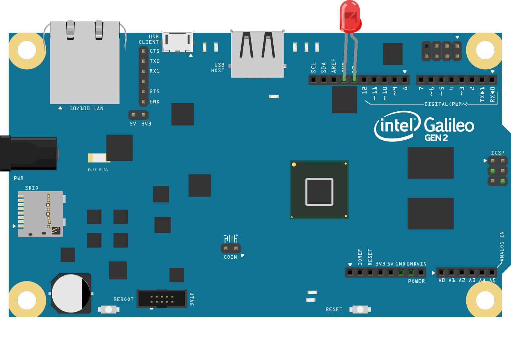

# Smart-Highways-Internet-of-Things

This is the implementation of a robust system for real time monitoring of highways. Various sensors have been deployed on highway which report the status of the same to a central control station.

The highway monitoring system is divided into different modules:
* **Smart fencing**
* **Sound signal based accident detection**
* **Weather detection**
* **RFID toll tax collection**
* **Activity based road light**
* **Collision avoidance system**

## Hardware

The aforementioned modules were integrated using [Intel Galileo Gen 2](https://software.intel.com/en-us/iot/hardware/galileo) IoT kit. Arduino IDE was used to write sequential codes for the modules. 

All the sensors used [ZigBee](https://www.digi.com/lp/xbee) protocol for wireless serial communication. MATLAB was used to detect accident sounds from the speech signals obtained.

Each module is described below:

### [Audio Signal Based Accident Detection](Speech signal processing)

The input to the system is a 3-s segment of audio signal. The system can be operated in two modes: the
two-class and multiclass modes. The output of the two-class mode is a label of "crash" or "noncrash." In the multiclass
mode of operation, the system identifies crashes as well as several types of noncrash incidents, including normal traffic and construction sounds. The system is composed of three main signal processing stages: feature extraction, feature reduction, and classification.

* Network of audio sensors installed on the highway collect the data which is first preprocessed and their intensity is calculated by local(nearer to sensor) Intel Galileo Gen-2. 
* If the intensity of captured data is higher than threshold then Intel Galileo sends this entire data frame to command center using wireless communication (Xbee). 
* At command center, from given data audio signal is reconstructed. After reconstruction of the signal one can can do the re sampling on desired rate (in this case it is 16 kHz). 
* After Preprocessing and resampling of the data, Spectrogramic analysis is done for accident and non-accident audio signals.
* Then MFCC of the data frame is calculated and KNN classifier is used for classification. Training has been done with numerous accident and non accident sound samples. 
* Classifier is providing very high efficiency classification.

Fig 1 and 2 shows spectrograms of accident and non-accident sound signals.

### [RFID based Toll-Tax Collection](RFID-toll-collector)

Toll collection booths often become bottlenecks of the highway which leads to stagnant traffic. We have tried to automate this process by proposing a RFID based solution for automatic toll collection.

* A RFID transmitter is assumed to be in the number plate of the car. This gives every car a unique identification number. There is a RFID reader installed on the road a sufficient distance before from the gate. 
* When a car approaches the toll booth the RFID reader reads the tag installed on the car. The identification number is linked to the account of the customer. 
* If the toll is successfully collected the gate is opened for the approaching vehicle. In case the car is stolen and a complaint has been registered the toll booth is notified and the gate remains closed.

### Collision Avoidance System using IR sensors

Collision avoidance sensors provide analog proximity measurements for various collision occurring hazards. Collision
avoidance sensors are used to prevent collision of automatic guided vehicles with either to some other vehicle or person moving on the road. In addition, collision avoidance sensors are also used as a protective system in robot arms and docking bays, and as a safety system in automatic shelving.

The system comprises of 3 components
• IR transmitters on the fence
• IR sensors mounted on the vehicle
• Intel galileo gen 2 mounted on vehicle

* The IR transmitters on the fence create a region of IR rays around the fence.
* When the vehicle is in close proximity of the fence, the IR sensors sense the rays and send the signal to the Intel Galileo gen 2 on the vehicle.
* Depending on which sensor sensed the IR rays, the board then issues a warning to the driver indicating the direction in which, the driver is close to the fence.

### [Smart Street Light](Smart-Street-Light)

Street Lights in areas with sparse activity are source of major power drainage. Here is proposed an activity based rood light. This includes controlling the circuit of Road lights with self-designed sensors using basic
components like IR Sensor, LDR, Transistors, resistors and capacitors.

* The module consists of an IR transmitter mounted on the base of the street light, an IR sensor on the opposite side of the road which is connected to an intermediate comparator circuit which is then further connected to intel galileo gen 2.
* During night, when there is no activity, the sensor receives the IR signal continuously and hence, the comparator sends no signal to the galielio board. In this case, only 1 out of every 10 street lights are switched on.
* Whenever there is an activity on the street, there is discontinuity in the received IR signal and a signal is sent the galilieo board. In this case, 5 street lights on either side of the sensor are switched on by the galileo board, and remain so for a fixed delay as to provide smooth transition for a moving vehicle.

### [Smart Fencing for Landslide and Accident Detection](smart-fence)

Highways built on hilly terrains have very frequent sharp turns which might become hazardous for vehicles. Now and
then we hear incidents of vehicles falling off the cliff resulting in casualties as help could not be offered on time. The probability of detecting such a mishap and sending help on time is very less as there is no preventive system for that.

* The idea proposed is that accelerometers will be mounted on the fence at particular intervals on the fence running throughout the highway.
* The intel galileo on the sensor side will receive the acceleration of the fence in X, Y and Z direction at a particular sampling rate.
* This vector will be sent to control centre using wireless communication. At the control centre magnitude of the acceleration is calculated.
* If there is an impact on the fence, there will be a sudden rise in the magnitude of the acceleration. If the rise is greater than the preset threshold, the impact will be reported and will initiate the process to send help at the location.

Another aim of this module is to detect landslides which are too very common in hilly terrains. The same method will
be used to detect the impact of debris on the fence so that the alert can be broadcasted.

### Wireless Module

Xbee has been used for wireless communication. Xbee works on Zigbee protocol and has satisfactory pecifications: 2.4GHz, range 1 mile approx., point to point as well as mesh network support, can work on UDP as well as TCP, low power requirements and also automatically goes to sleep when not used, thus saving power. Here used mode is point to point communication model over UDP. One Xbee is configured as router and connected with system on the controller side, other Xbee is configured as Coordinator and connected with Galileo Gen 2. Both the Xbee are configured in AT mode which is a transparent mode with fix destination address. Both the Xbee can send and receive data simultaneously. Xbee
have fix MAC address, so for point to point communication Destination High(DH) and Destination Low(DL) addresses of
other Xbee has to match with the MAC of current one. For fix DH and DL, Xbee uses UDP as their transport protocol.

For a simple model, the point to point communication works good but during practical application there would be a large mesh of network handling different sensors deployed at different sites. Fortunately, Xbee has API mode in which Xbee first search for another remote Xbee and enquires about it’s MAC address to send data. Xbee in API mode use TCP as
it’s transport layer protocol. We can make any types of mesh or network of layers using Xbee, so while planning deploy
map of sensors, Xbee configurations should be kept in mind.
